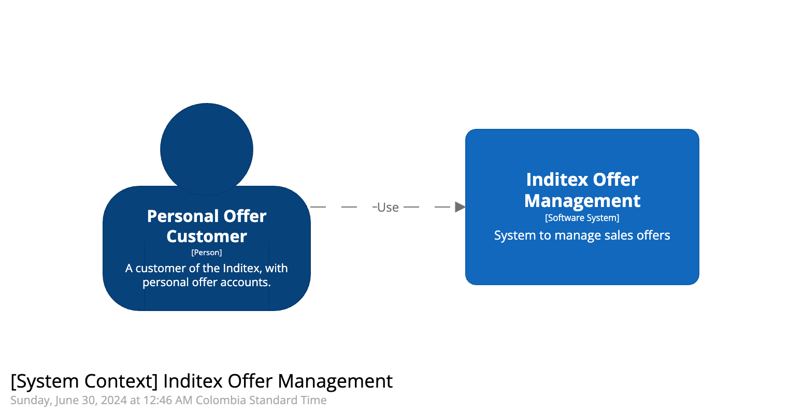
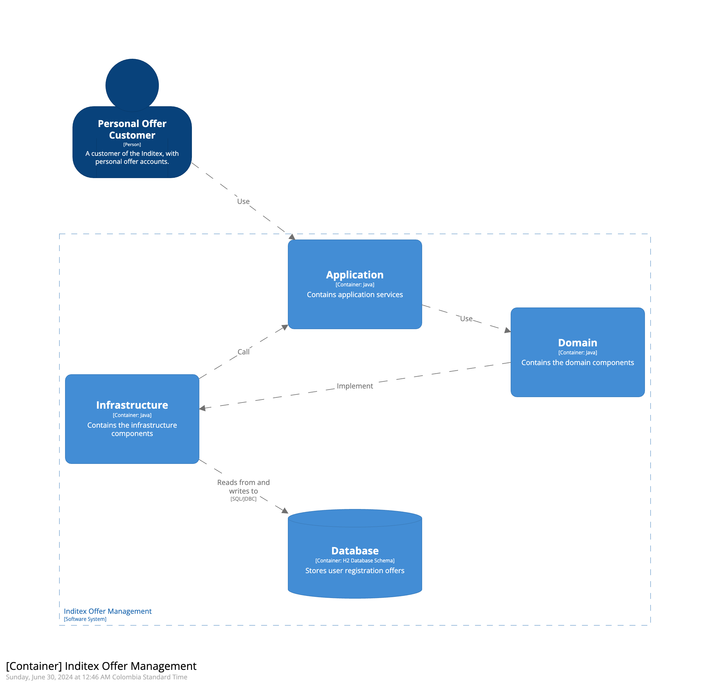
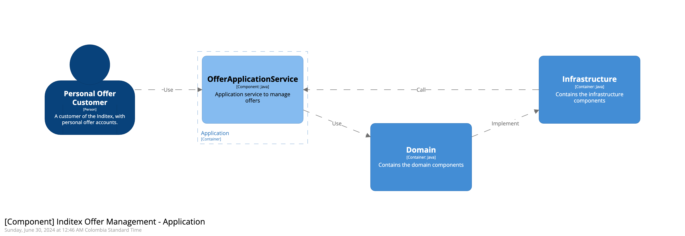
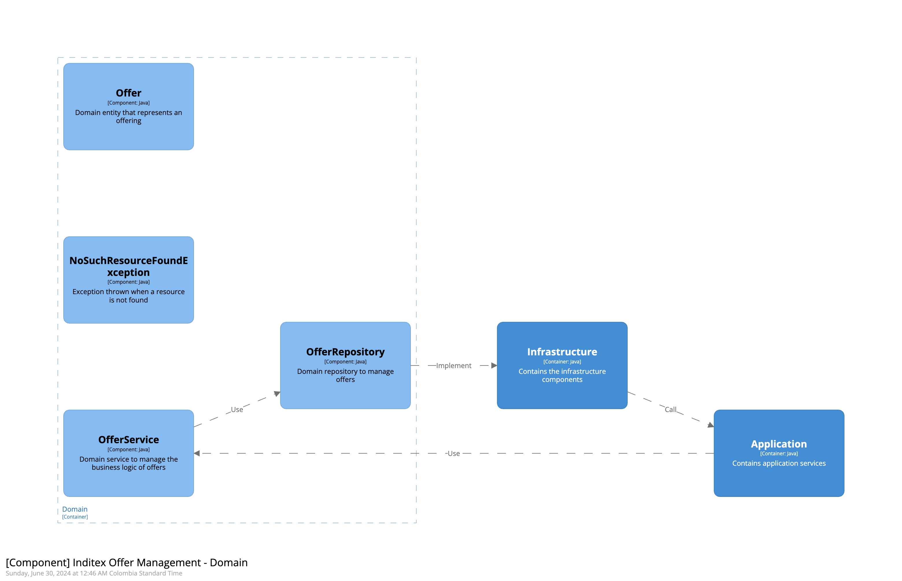
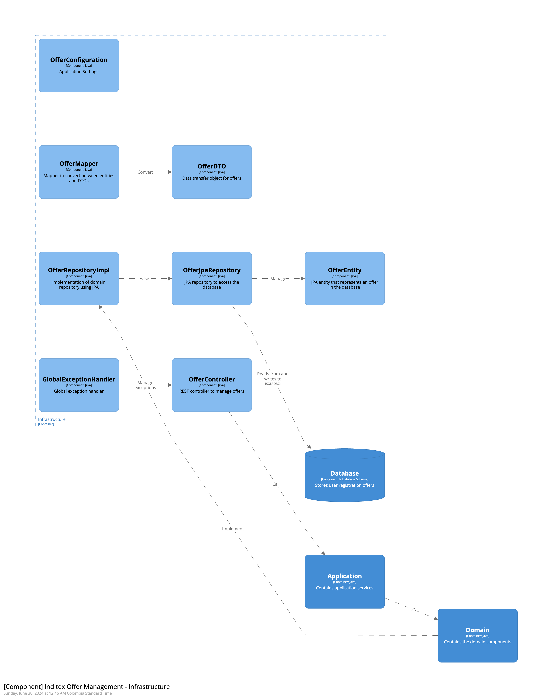

# Arquitectura Hexagonal y DDD

Este proyecto sigue una arquitectura Hexagonal y DDD. A continuación, se detalla la estructura arquitectonica, directorios y una descripción de las capas correspondientes a esta arquitectura:

Al final de este articulo encontrarás los anexos que se dejan a nivel de documentación y pruebas.
## Documentación Arquitectura - C4 Model

## System Context Diagram

Diagrama de contexto del sistema para la gestión de ofertas de Inditex. Este diagrama muestra la interacción entre dos entidades principales:

1. Personal Offer Customer (Cliente de Oferta Personal):

- Tipo: Persona.
- Descripción: Un cliente de Inditex con cuentas de ofertas personales.

2. Inditex Offer Management (Gestión de Ofertas de Inditex):

- Tipo: Sistema de software.
- Descripción: Sistema para gestionar las ofertas de ventas.

La relación entre estas dos entidades está representada por una flecha etiquetada como "Use" (Usar), indicando que el "Personal Offer Customer" utiliza el sistema "Inditex Offer Management" para gestionar sus ofertas personales.

## Container Diagram

Diagrama de contenedores que muestra la arquitectura de gestión de ofertas de Inditex. En este diagrama se representan los principales componentes del sistema y sus interacciones. Los elementos y sus relaciones son los siguientes:

1. Personal Offer Customer (Cliente de Oferta Personal):

- Tipo: Persona.
- Descripción: Un cliente de Inditex con cuentas de ofertas personales.
- Relación: Usa el contenedor "Application".
2. Application (Aplicación):

- Tipo: Contenedor (Java).
- Descripción: Contiene servicios de la aplicación.
- Relación:
  - Es usado por el "Personal Offer Customer".
  - Usa el contenedor "Domain".
  - Llama al contenedor "Infrastructure".
3. Domain (Dominio):

- Tipo: Contenedor (Java).
- Descripción: Contiene los componentes del dominio.
- Relación: Es usado por el contenedor "Application".
4. Infrastructure (Infraestructura):

- Tipo: Contenedor (Java).
- Descripción: Contiene los componentes de la infraestructura.
- Relación:
  - Es llamado por el contenedor "Application".
  - Implementa y accede a la base de datos "Database".
5. Database (Base de Datos):

- Tipo: Contenedor (H2 Database Schema).
- Descripción: Almacena las ofertas de registro de usuarios.
- Relación: Es leída y escrita por el contenedor "Infrastructure".

El sistema de gestión de ofertas de Inditex está compuesto por estos contenedores interconectados, donde cada uno tiene un rol específico y colabora para proporcionar la funcionalidad necesaria para gestionar las ofertas de ventas.

## Component Diagram
- Es el núcleo de la aplicación, contiene toda la lógica de negocio y no depende de otras capas. Se comunica con la capa de aplicación a través de interfaces.
### Component Diagram - Application

Diagrama de componentes muestra la arquitectura de la aplicación de gestión de ofertas de Inditex. En este diagrama se representan los principales componentes del sistema y sus interacciones dentro del contenedor de la aplicación. Los elementos y sus relaciones son los siguientes:

1. Personal Offer Customer (Cliente de Oferta Personal):

- Tipo: Persona.
- Descripción: Un cliente de Inditex con cuentas de ofertas personales.
- Relación: Usa el componente "OfferApplicationService".
2. OfferApplicationService:

- Tipo: Componente (Java).
- Descripción: Servicio de aplicación para gestionar ofertas.
- Relación:
  - Es usado por el "Personal Offer Customer".
  - Llama al contenedor "Domain".
  - Usa el contenedor "Infrastructure".
3. Domain (Dominio):

- Tipo: Contenedor (Java).
- Descripción: Contiene los componentes del dominio.
- Relación:
  - Es llamado por el componente "OfferApplicationService".
4. Infrastructure (Infraestructura):

- Tipo: Contenedor (Java).
- Descripción: Contiene los componentes de la infraestructura.
- Relación:
  - Es usado por el componente "OfferApplicationService".
  - Implementa y accede a la base de datos.


### Component Diagram - Domain

Diagrama de componentes que muestra la arquitectura del dominio en la gestión de ofertas de Inditex. En este diagrama se representan los principales componentes del dominio y sus interacciones. Los elementos y sus relaciones son los siguientes:

1. Offer (Oferta):

- Tipo: Componente (Java).
- Descripción: Entidad de dominio que representa una oferta.
2. NoSuchResourceFoundException:

- Tipo: Componente (Java).
- Descripción: Excepción lanzada cuando no se encuentra un recurso.
3. OfferService:

- Tipo: Componente (Java).
- Descripción: Servicio de dominio para gestionar la lógica de negocio de las ofertas.
- Relación: Usa el componente "OfferRepository".
4. OfferRepository:

- Tipo: Componente (Java).
- Descripción: Repositorio de dominio para gestionar las ofertas.
- Relación:
  - Es usado por el componente "OfferService".
  - Implementa y se comunica con el contenedor "Infrastructure".
5. Infrastructure (Infraestructura):

- Tipo: Contenedor (Java).
- Descripción: Contiene los componentes de la infraestructura.
- Relación:
  - Es implementado por el componente "OfferRepository".
  - Se comunica con el contenedor "Application".
6. Application (Aplicación):

- Tipo: Contenedor (Java).
- Descripción: Contiene servicios de la aplicación.
- Relación: Llama al contenedor "Infrastructure".

### Component Diagram - Infrastructure

Diagrama de componentes que muestra la infraestructura del sistema de gestión de ofertas de Inditex. Este diagrama detalla los componentes clave dentro del contenedor de infraestructura y sus interacciones. Los elementos y sus relaciones son los siguientes:

1. OfferConfiguration:

- Tipo: Componente (Java).
- Descripción: Configuraciones de la aplicación.
2. OfferMapper:

- Tipo: Componente (Java).
- Descripción: Mapeador para convertir entre entidades y DTOs.
- Relación: Convierte a "OfferDTO".
3. OfferDTO:

- Tipo: Componente (Java).
- Descripción: Objeto de transferencia de datos para ofertas. 
4. OfferRepositoryImpl:

- Tipo: Componente (Java).
- Descripción: Implementación del repositorio de dominio usando JPA.
- Relación: Usa "OfferJpaRepository".
5. OfferJpaRepository:

- Tipo: Componente (Java).
- Descripción: Repositorio JPA para acceder a la base de datos.
- Relación: Gestiona "OfferEntity".
6. OfferEntity:

- Tipo: Componente (Java).
- Descripción: Entidad JPA que representa una oferta en la base de datos.
7. GlobalExceptionHandler:

- Tipo: Componente (Java).
- Descripción: Manejador global de excepciones.
8. OfferController:

- Tipo: Componente (Java).
- Descripción: Controlador REST para gestionar ofertas.
- Relación:
  - Gestiona las excepciones mediante "GlobalExceptionHandler".
  - Lee y escribe en la base de datos "Database".
9. Database:

- Tipo: Contenedor (H2 Database Schema).
- Descripción: Almacena las ofertas de registro de usuarios.
- Relación:
  - Es llamada por "OfferController".
  - Implementa la base de datos accesible por "OfferJpaRepository".
10. Application:

- Tipo: Contenedor (Java).
- Descripción: Contiene servicios de la aplicación.
- Relación: Implementa la funcionalidad necesaria.
11. Domain:

- Tipo: Contenedor (Java).
- Descripción: Contiene los componentes del dominio.
- Relación: Es usado por "Application".


## Estructura de Directorios
```
technicaltest05-main
├── application
│   └── src
│       └── main
│           └── java
│               └── com
│                   └── inditex
│                       └── hiring
│                           └── OfferApplicationService.java
├── domain
│   └── src
│       └── main
│           └── java
│               └── com
│                   └── inditex
│                       └── hiring
│                           └── domain
│                               ├── model
│                               │   └── Offer.java
│                               ├── repository
│                               │   └── OfferRepository.java
│                               ├── exception
│                               │   └── NoSuchResourceFoundException.java
│                               └── service
│                                   └── OfferService.java
├── infrastructure
│   └── src
│       └── main
│           └── java
│               └── com
│                   └── inditex
│                       └── hiring
│                           └── infrastructure
│                               ├── configuration
│                               │   └── OfferConfiguration.java
│                               ├── persistence
│                               │   ├── OfferEntity.java
│                               │   ├── OfferJpaRepository.java
│                               │   └── OfferRepositoryImpl.java
│                               └── rest
│                                   ├── OfferController.java
│                                   ├── OfferDTO.java
│                                   ├── OfferMapper.java
│                                   └── exception
│                                       └── GlobalExceptionHandler.java
└── pom.xml
```

## Descripción de las Capas de la Arquitectura Hexagonal y DDD

1. **Domain Layer (Capa de Dominio)**
   - **`domain/model`**: Aquí se definen las entidades y objetos de valor de dominio. Ejemplo: `Offer.java`.
   - **`domain/repository`**: Define interfaces de repositorios que deben ser implementadas por la infraestructura. Ejemplo: `OfferRepository.java`.
   - **`domain/exception`**: Contiene excepciones específicas del dominio. Ejemplo: `NoSuchResourceFoundException.java`.
   - **`domain/service`**: Contiene la lógica de negocio y casos de uso de la aplicación. Ejemplo: `OfferService.java`.

2. **Application Layer (Capa de Aplicación)**
   - **`application`**: Contiene la entrada y salida a la lógica de negocio y casos de uso de la aplicación. Ejemplo: `OfferApplicationService.java`.

3. **Infrastructure Layer (Capa de Infraestructura)**
   - **`infrastructure/configuration`**: Contiene configuraciones específicas de la infraestructura, como beans de Spring. Ejemplo: `OfferConfiguration.java`.
   - **`infrastructure/persistence`**: Implementaciones concretas de los repositorios, mapeo de entidades a tablas de base de datos. Ejemplos: `OfferEntity.java`, `OfferJpaRepository.java`, `OfferRepositoryImpl.java`.
   - **`infrastructure/rest`**: Controladores REST, DTOs y mappers para manejar las solicitudes HTTP. Ejemplos: `OfferController.java`, `OfferDTO.java`, `OfferMapper.java`.
   - **`infrastructure/rest/exception`**: Manejadores globales de excepciones para las API REST. Ejemplo: `GlobalExceptionHandler.java`.

### Detalles de la Arquitectura Hexagonal
- **Domain Layer**: Es el núcleo de la aplicación, contiene toda la lógica de negocio y no depende de otras capas. Se comunica con la capa de aplicación a través de interfaces.
- **Application Layer**: Orquesta la lógica de negocio y se comunica con la infraestructura y el dominio. Implementa los casos de uso de la aplicación.
- **Infrastructure Layer**: Provee las implementaciones concretas de las interfaces definidas en el dominio y expone servicios al mundo exterior (APIs REST, base de datos, etc.).

Esta arquitectura permite una alta cohesión dentro de cada capa y un bajo acoplamiento entre las capas, facilitando la mantenibilidad y la evolución del sistema.

## Anexos
1. **DSL Workspace Structurizr**: Se deja en el root del proyecto el DSL para poder visualizar los diagramas de arquitectura por medio del componente Structurizr. Copiar y pegar el código en el siguiente link https://structurizr.com/dsl
2. **Colección de Postman**: Se adjunta al proyecto la colección de Postman con la que se puede probar todo el código.